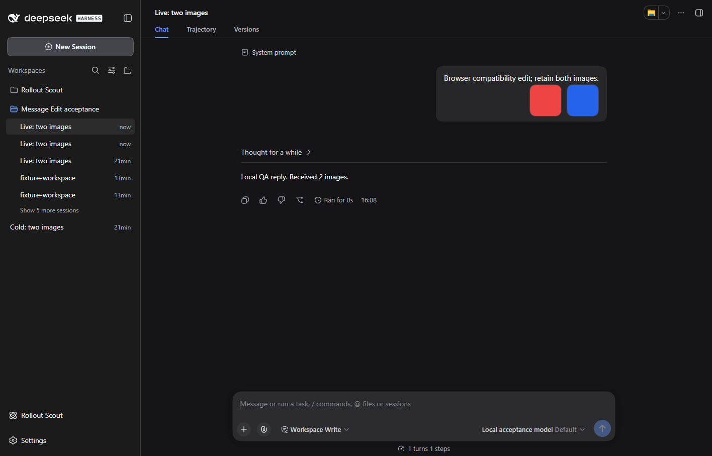

# DSH 0.1.5-rc.2 compatibility

Verified on 2026-09-20 against npm latest/next `0.1.5-rc.2`. The alpha tag is `0.1.6-alpha.2` and is outside this release's declared range.

Fix seeded edit/retry creation, clear inherited pending input before publication, identify version markers by session ownership, preserve reasoning effort, and read persisted branches through disposable session observations.

## Validation

`npm test` and `npm run check:package` pass.

Real HTTP edit/retry tests cover live and cold sources, exactly one replayed user turn, images, sibling retries, nested markers, fresh boot and restart, and resuming an already seeded branch. CI repeats the official-runtime acceptance on Linux and Windows. Browser acceptance submits an edit, loads both retained images, and opens the version tree.

All four SpookySandwich plugins were loaded together in a separate DSH home using the official published CLI/Web packages, generated images and a deterministic offline model. No remote model service was exercised. Browser runs own and close their separate headless Edge process; user profiles and conversations are not test targets.

