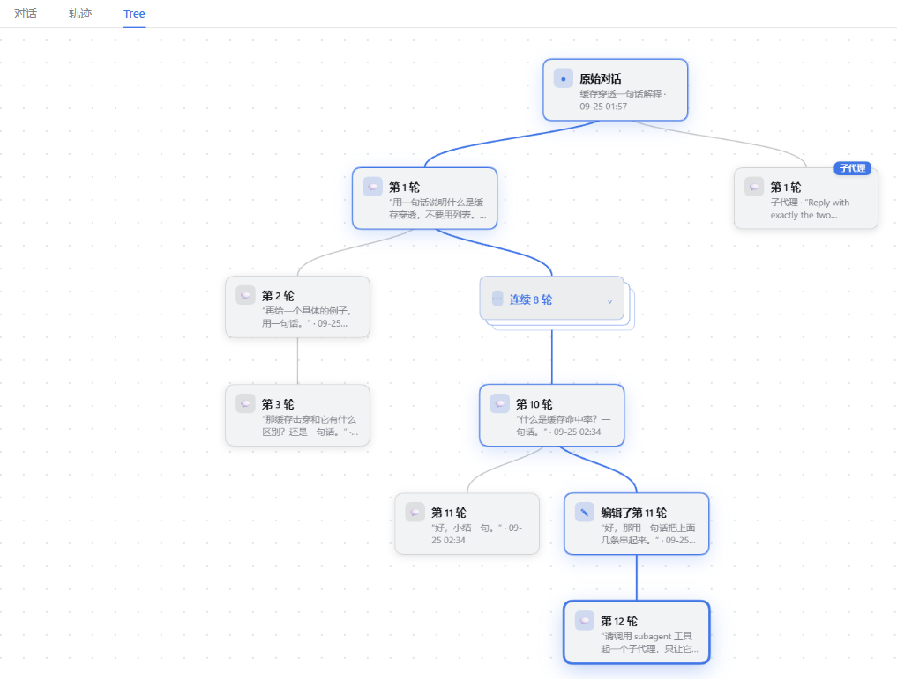

<div align="center">


# dsh-tree-view

**TreeView —— 以树形视图使用会话**

简体中文 | [English](README.en.md)

编辑一条旧消息，对话从那一刻分叉；分叉出来的版本都住进同一棵树，侧栏里始终只有一条。


[](https://www.npmjs.com/package/dsh-tree-view)
[](./LICENSE)
[](#安装)
[](#版本与兼容)
[](#参与贡献)
[](https://github.com/Rice00/dsh-tree-view/stargazers)

</div>

---

**编辑一条已经发出的消息**，或用 DSH 自带的「**在新对话中分支**」按钮，都会在这里长出一条新分支：


在会话面板切到 Tree，整个家族画在一张图上：



## 功能

| 功能 | 说明 |
|---|---|
| 🖱️ **点击节点跳转** | 树上每个节点都是一个真实的会话版本，点它你就切到那条线继续聊。背后只是翻转归档状态：被点的解除归档、回到侧栏，你原本在读的那条归档、收进树 —— 所以从树里点来点去，侧栏位置只换不增。 |
| 🔀 **多线并行** | 版本本身就是会话。右键「放到主对话」可以把多个版本都放出来（这一步只解除归档、不动别人），让两条分支同时工作、互不干扰；不需要同时看了，再收进树。 |
| 🧹 **一键收起** | 面板工具栏的「收起其它分支」一次把该家族散落在侧栏的其它版本全收进树，只留你正在用的那条；若其中有版本还在生成回复，会先问你是停掉再收还是取消，不会悄悄掐掉工作。 |
| 🗂️ **长段折叠** | 一连串没有分叉的长轮次 —— 包括所有版本共用的开头 —— 达到设定长度就折成一个节点，点开即看；阈值在设置里选，工具栏上随时折回，折完自动重新居中。 |
| 🚫 **隐藏空副本** | 只复制了本对话、自己没聊出新内容的 Fork 不画出来，工具栏上有同一个开关。 |
| ✏️ **分支重命名** | 右键节点给分支起个名字。侧栏标题仍是宿主自己的（`(1)`、`(2)` 那套照旧），被命名的只有树上的盒子。 |
| 🔄 **版本环切换** | 气泡下方的 `‹ n/m ›` 环，不离开对话就能在同一个问题的几个版本之间来回。 |
| 🎯 **在读路径高亮** | 你正在读的整条线 —— 含各版本共用的开头 —— 在树上一路高亮，一眼看出从哪来、现在在哪、还能去哪。 |
| 📌 **接着上次阅读** | 从别的会话回到这个家族时，接着你上次读的那条版本（默认关，可在设置里打开）。 |
| 🤖 **子代理标识** | 挂在你这个对话下面的子代理会话带标签，不会被误认成你的一个版本。 |
| 📦 **归档的分支不消失** | 被归档（收起）的版本仍留在树上，只是变暗并标「已归档」—— 归档是让侧栏少一个入口，不是把分支删掉。 |
| 🎨 **跟随主题** | 背景、边框、强调色、状态色连阴影都取自宿主主题变量，浅色跟随浅色、深色跟随深色。 |

## 实现原理

| 要点 | 说明 |
|---|---|
| **回退而非续写** | 编辑时，宿主拿「那一轮之前的全部事件」做种子新建一个会话，再把改后的提问送进去 —— 新版本从你改的那一句重新开始，工作目录与上下文都照旧，不是新开一个空会话。DSH 自带的「在新对话中分支」产生的也是这种以历史为种子的会话，插件照样按种子长度算出分叉点。 |
| **旧版本不消失** | 原来那条线仍在树里，点一下就回到它；两条线都能继续往下聊，互不干扰。 |
| **不替你归档** | 编辑、重试、从侧栏打开会话、恢复上次阅读位置，都不改任何归档状态 —— 只有你从树里挑版本、或按下「收起其它分支」时才会。否则你随手改一次措辞，原会话就被悄悄收走了。 |

## 图例

| 图上的东西 | 意思 |
|---|---|
| 一根主干 | 所有版本共用的开头，也就是还没分叉的那几轮 |
| 一处开叉 | 一次编辑：一侧是原版，另一侧是改过的版本 |
| 高亮的线 | 你正在读的这条，从对话起点连着你现在看的那一轮 |
| 一叠薄片 | 被折起来的连续轮次 |

可平移、滚轮缩放、点节点跳过去；右键节点可重命名，也可决定它住在侧栏还是住在树里。

## 归档与恢复

插件唯一碰你数据的地方是「归档」这一个开关，单独说清楚：

- **收进树** = 让该版本在 DSH 侧栏里归档；**放回主对话** = 取消归档。这个 DSH 版本没有取消归档的 API，插件只能按归档登记表自己的写法规矩去写它 —— 这块集中在 `lib/archive-adapter.js`，启动时先探测宿主支持到什么程度，缺了就写日志、置灰按钮，树的其余功能照常。
- **不删、不复制、不改写会话内容。** 会话日志是仅追加的；除了分叉时必须写的那一条 `message-tree/version` 标记，插件不往里加任何东西。
- **卸载之后**所有会话都还在，被收进树的那几条可以在 DSH 的归档列表里取消归档。分支名与「谁被收进树」记在 `~/.dsh/storages/tree-view/state.json`，留着不碍事，删掉也不影响会话。

## 安装

从 npm 装：

```bash
dsh plugin --profile web add dsh-tree-view
```

也可以直接从 GitHub 装：

```bash
dsh plugin --profile web add github:Rice00/dsh-tree-view
```

补丁会往 profile 里插一行（`tree-view`）。**然后重启这个 profile** —— 宿主插件模块在进程内缓存，运行中的 harness 读不到新行；只改界面的话刷新浏览器就够了。

本地检出（改完即用；`link:` 是活链接，装完不能挪动这个目录）：

```bash
git clone https://github.com/Rice00/dsh-tree-view.git
dsh plugin --profile web add link:/abs/path/to/dsh-tree-view
```

<details>
<summary>让 AI 助手帮你装（整段复制）</summary>

```
请帮我安装 DSH 插件 dsh-tree-view：
1) 装进 web profile：
     dsh plugin --profile web add dsh-tree-view                    （npm）
     dsh plugin --profile web add github:Rice00/dsh-tree-view      （GitHub）
     dsh plugin --profile web add link:<绝对路径>                   （本地检出）
2) 重启该 profile；只改界面的话刷新浏览器即可。
3) 验证：会话面板出现 Tree 标签页，设置里出现 TreeView 分类。
```

</details>

## 版本与兼容

**1.0.0 冻结的是插件自己的面**：配置键，三个持久格式 —— 会话日志里的 `message-tree/version` 标记（`schemaVersion: 1`）、sidecar 存储 `~/.dsh/storages/tree-view/state.json`、浏览器偏好 `dsh-tree-view:prefs`（`v: 2`）—— 以及下表里已验收的宿主区间。它们此后只在 major 版本里变，并且带迁移；宿主越出这个区间不算破坏承诺，而是需要一次兼容版本。

| DSH 版本 | 状态 |
|---|---|
| `0.1.5-rc.2` | 已验收 —— 端到端验收：编辑、重试、重启后读回分支、嵌套标记与图片留存 |
| `0.1.7-rc.1` | 已验收 —— 同一套宿主端验收；客户端同时适配两代会话导航 API |
| `0.1.5-rc.3` 等 `0.1.x` | 在同一 `engines` 区间内，尚未单独验收 |
| `0.2.x` | 区间之外 —— 可以装来试，出问题欢迎开 issue |

宿主换版本线时，先在 CI 的宿主矩阵里跑过验收，再改区间 —— 矩阵里列的正是上表这两个已验收版本。

**客户端只为一件东西停下**：`slots`（没有它就无处注册）。其余全部按「有则用、无则退」：会话导航两代 API 都认（0.1.7 的 `uiWorkspace.openSession` 与更早的 `sessions.open`），会话列表与语言包走可选注入，子代理目录同时读两代字段。宿主把某个服务改名或去掉，最坏结果是这项能力降级，而不是插件装上却整个不出现。

## 与上游的关系

本仓库是 [dsh-plugin-message-edit](https://github.com/SpookySandwich/dsh-plugin-message-edit) 的 fork，宿主端的分支引擎来自它（其分支逻辑又源自 [dsh-message-edit](https://github.com/Moeblack/dsh-message-edit)）。区别在重心：上游是「编辑消息」插件，本 fork 把「编辑出来的那些版本住在哪里」当成主要问题 —— 于是有了树、换位和折叠。

两个插件可以并存：行 id（`tree-view`）与 HTTP 路由（`/tree-view`）都是独立的；但**持久事件类型仍沿用上游的 `message-tree/version`**，所以上游已经分过叉的会话在这里照样读出树，不需要迁移数据。只装它、不装上游也可以，它不是依赖。

## 常见问题

**会不会把我的会话弄乱？**
不会。编辑只产生新版本，不改写原会话；而且没人替你归档，位置只在你自己挑版本或按「收起其它分支」时才变。

**被收进树的版本去哪找？**
在 Tree 标签页里；右键「放到主对话」就回到侧栏，也可以在 DSH 的归档列表里取消归档。

**能同时开好几条分支聊吗？**
能。每个版本都是独立会话，把它们逐个「放到主对话」即可并行；不想一起看的时候再收进树。

**长家族会不会看不清？**
折叠就是为这个做的：设置里可改成永不折，也可以随时手工折回；**折起或展开之后视图会自动重新居中一次** —— 一次点击可能多出上百张卡，不用你自己去找树在哪。

**DSH 自带的分支按钮产生的会话也会进树吗？**
会。它同样是一个以历史为种子的会话，插件按种子长度算出分叉点，画成这条线上的一个版本。DSH 自己限制这个按钮只能用在**已完成轮次的最后一条消息**上，插件不改这个限制。

**支持哪个版本的 DSH？**
见「版本与兼容」。`engines.dsh` 声明 `>=0.1.5-rc.2 <0.1.6-0`，区间里已验收的是 `0.1.5-rc.2`。更新插件后请重启 DSH。

## 设置

设置 → **TreeView**，五项，面板里逐项说明：

| 设置 | 默认 | 说明 |
|---|---|---|
| 消息操作样式 | `DeepSeek` | `ChatGPT` / `DeepSeek` / `Claude` 三种按钮布局，面板内实时预览。 |
| 打开我上次在读的那条版本 | `off` | 见「接着上次阅读」。 |
| 先停掉还在生成的回复 | `on` | 编辑 / 重试前先停掉同一家族里还在跑的回复（含其它版本），省额度，也允许在回复途中编辑。 |
| 不画没有新内容的副本 | `on` | 见「隐藏空副本」，工具栏上有同一个开关。 |
| 折叠过长的连续轮次 | `8 轮及以上` | `永不` / `5` / `8` / `12` / `20`，按每一段各算，见「长段折叠」。 |

## 给要改代码的人

<details>
<summary>路由、事件与文件结构</summary>

只有一条路由，挂在宿主半边：

```
GET  /tree-view?sessionId=…   读这个家族：家族 DAG、轮次边界、归档状态、正在跑什么
POST /tree-view               建一条分支（截断 → 写标记 → 建 agent → 送改后的提问）
POST /tree-view  action=…     activate 取消归档 · label 命名 · promote 放回 · demote 收进树 · demoteOthers 收齐
```

分叉写入的持久事件是 `message-tree/version`，带 `ignorable: true` 信封标志 —— 少了它，读取端会拒绝解释整份日志，会话直接打不开。

```
lib/index.js            宿主半边 —— 路由 / 分支事务 / 家族遍历
lib/tree-logic.js       树构建与布局（纯函数，宿主与客户端共用）
lib/tree-state.js       分支名与归档归属的 sidecar
lib/session-record.js   把各版本的会话记录读成同一种形状
lib/archive-adapter.js  唯一与宿主归档强耦合的地方
plugin.client.js        客户端半边（源）
lib/client.js           客户端半边（产物，scripts/build-client.mjs 打包）
test/                   16 个行为级测试文件
docs/                   架构 / 树数据模型 / 开发
```

宿主半边不热重载（改 `lib/index.js` 要重启 profile），客户端半边刷新页面即可。

</details>

## 参与贡献

Issue 和 PR 都欢迎。改完先跑 `npm test`。

## 许可证

[MIT](./LICENSE)

本仓库是上游的 fork，上游与更早的 dsh-message-edit 的版权声明及其许可原文保留在 [NOTICE](./NOTICE)。

<div align="center">
<sub>TreeView —— 以树形视图使用会话</sub>

MIT License © Rice00
</div>
